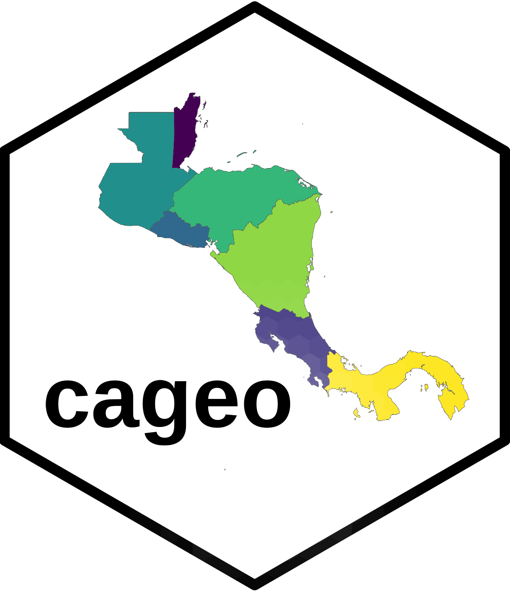

<!-- README.md is generated from README.Rmd. Please edit that file -->

```{r, include = FALSE}
knitr::opts_chunk$set(
  collapse = TRUE,
  comment = "#>",
  fig.path = "man/figures/README-",
  out.width = "100%"
)
```

# cageo 

<!-- badges: start -->
<!-- badges: end -->

The goal of cageo is to provide geospatial data for Costa Rica

## Installation

You can install the development version of cageo from [GitHub](https://github.com/) with:

``` r
# install.packages("devtools")
devtools::install_github("ManuelSpinola/cageo")
```

## Example

This is a basic example which shows you how to use the package:

```{r example, message=FALSE, warning=FALSE}
## basic example code
library(cageo)
library(tidyverse)
library(sf)
```

```{r cr_outline}
ca_outline
```


```{r cr_mapa}
ggplot(ca_outline) +
  geom_sf() +
  theme_minimal()
```


