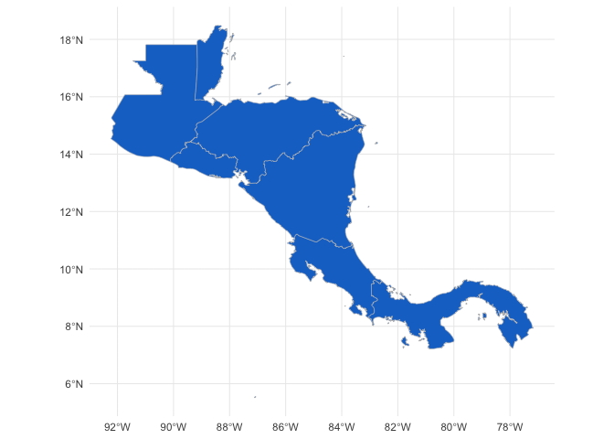
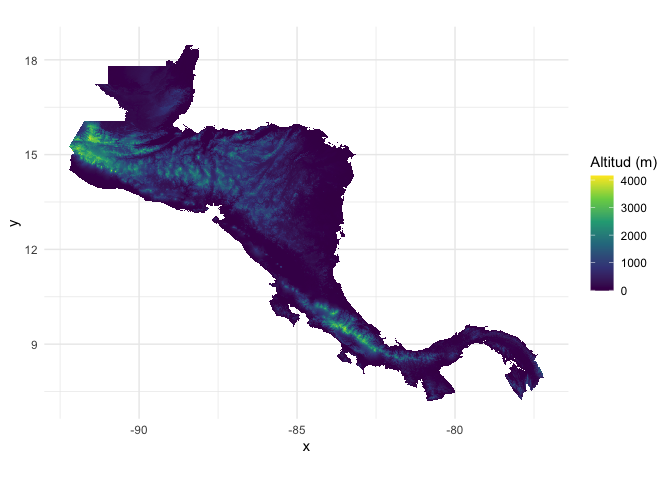

<!-- README.md is generated from README.Rmd. Please edit that file -->

# cageo 

<!-- badges: start -->
<!-- badges: end -->

The goal of cageo is to provide geospatial data for Costa Rica

## Installation

You can install the development version of cageo from
[GitHub](https://github.com/) with:

``` r
# install.packages("devtools")
devtools::install_github("ManuelSpinola/cageo")
```

## Example

This is a basic example which shows you how to use the package:

``` r
## basic example code
library(cageo)
library(tidyverse)
library(sf)
library(stars)
```

# Datos vectoriales

``` r
ggplot(ca_outline) +
  geom_sf(fill = "dodgerblue4", color = "gray") +
  theme_minimal()
```



# Datos raster

``` r
ggplot() +
  geom_stars(data = ca_elevation) +
  scale_fill_viridis_c(name = "Altitud (m)", na.value = "transparent") +
  theme_minimal() +
  coord_equal()
```


