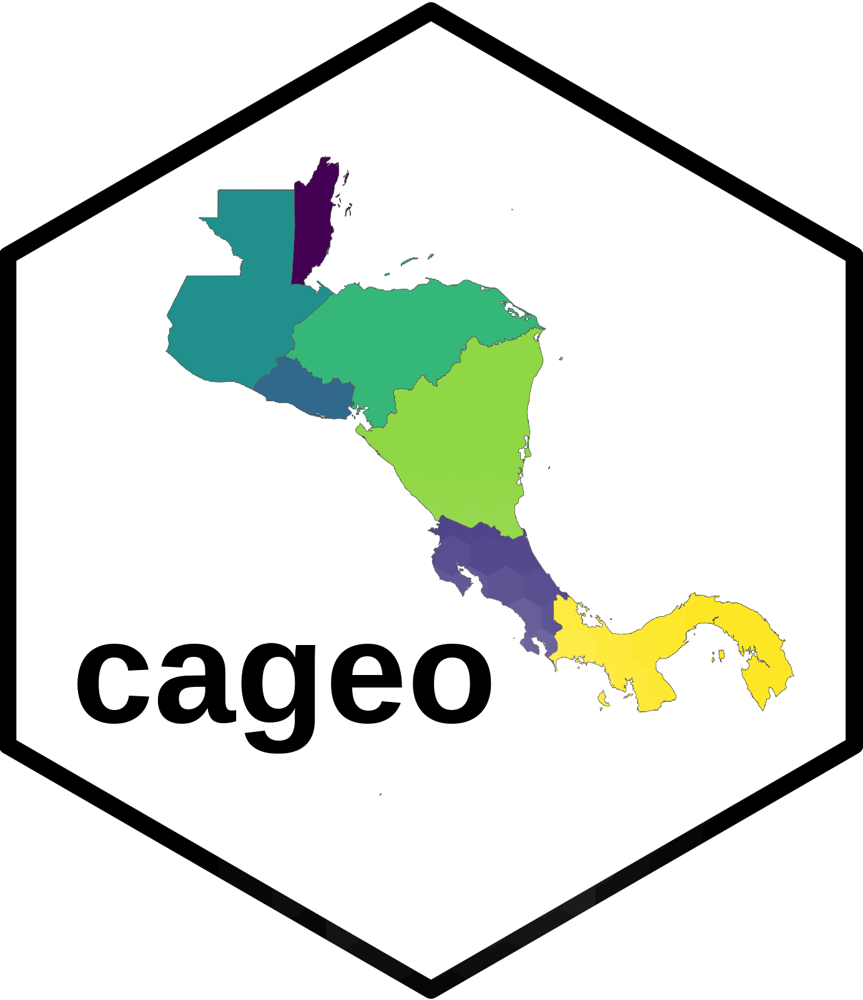

<!-- README.md is generated from README.Rmd. Please edit that file -->

# cageo 

<!-- badges: start -->
<!-- badges: end -->

The goal of cageo is to provide geospatial data for Costa Rica

## Installation

You can install the development version of cageo from
[GitHub](https://github.com/) with:

``` r
# install.packages("devtools")
devtools::install_github("ManuelSpinola/cageo")
```

## Example

This is a basic example which shows you how to solve a common problem:

``` r
library(cageo)
library(tidyverse)
#> ── Attaching packages ─────────────────────────────────────── tidyverse 1.3.2 ──
#> ✔ ggplot2 3.4.0      ✔ purrr   1.0.0 
#> ✔ tibble  3.1.8      ✔ dplyr   1.0.10
#> ✔ tidyr   1.2.1      ✔ stringr 1.5.0 
#> ✔ readr   2.1.3      ✔ forcats 0.5.2 
#> ── Conflicts ────────────────────────────────────────── tidyverse_conflicts() ──
#> ✖ dplyr::filter() masks stats::filter()
#> ✖ dplyr::lag()    masks stats::lag()
library(sf)
#> Linking to GEOS 3.10.2, GDAL 3.4.2, PROJ 8.2.1; sf_use_s2() is TRUE
## basic example code
```

``` r
ca_outline
#> Simple feature collection with 7 features and 1 field
#> Geometry type: MULTIPOLYGON
#> Dimension:     XY
#> Bounding box:  xmin: -92.22236 ymin: 5.49857 xmax: -77.12928 ymax: 18.49666
#> Geodetic CRS:  WGS 84
#>       COUNTRY                           geom
#> 1  Costa Rica MULTIPOLYGON (((-87.06877 5...
#> 2      Panama MULTIPOLYGON (((-81.8018 7....
#> 3   Guatemala MULTIPOLYGON (((-91.0107 13...
#> 4 El Salvador MULTIPOLYGON (((-88.46264 1...
#> 5    Honduras MULTIPOLYGON (((-87.72014 1...
#> 6   Nicaragua MULTIPOLYGON (((-84.92993 1...
#> 7      Belize MULTIPOLYGON (((-88.72097 1...
```

``` r
ggplot(ca_outline) +
  geom_sf() +
  theme_minimal()
```


